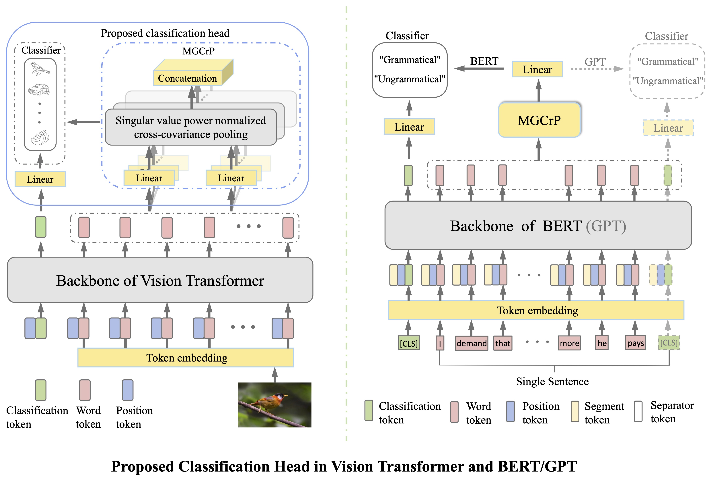
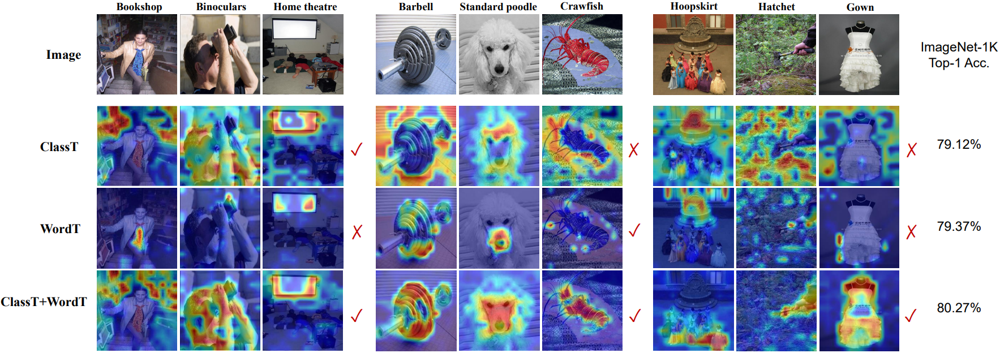
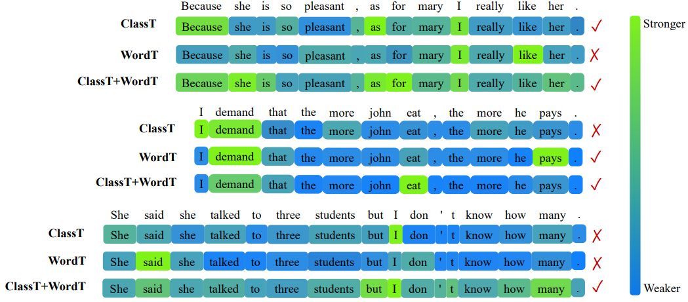

# SoT: Delving Deeper into Classification Head for Transformer


<div>
&emsp;&emsp;&emsp;&emsp;&emsp;&emsp;
</div>

## Contents

1. [Introduction](#introduction)
2. [Installation](#installation)
3. [Usage](#usage)
4. [Classification results on CV tasks](#classification-results-on-cv-tasks)
5. [Classification results on NLP tasks](#classification-results-on-NLP-tasks)
6. [Visualization](#visualization)
7. [Change log](#change-log)
8. [Acknowledgments](#Acknowlegments)
9. [Contact](#contact)


## Introduction

This repository is the official  implementation of "[SoT: Delving Deeper into Classification Head for Transformer](https://arxiv.org/pdf/2104.10935.pdf)". It
contains the source code under **PyTorch** framework and models for image classification and text classification tasks.

### Citation

Please consider cite the paper if it's useful for you. 

    @articles{SoT,
        author = {Jiangtao Xie, Ruiren Zeng, Qilong Wang, Ziqi Zhou, Peihua Li},
        title = {SoT: Delving Deeper into Classification Head for Transformer},
        booktitle = {arXiv:2104.10935v2},
        year = {2021}
    }

### Motivation and Contributions

For classification tasks whether in CV or NLP, the current works based on pure transformer architecture pay little attention to the classification head, applying **Classification token** (ClassT) solely in the classifier,  however neglecting the **Word tokens** (WordT) which contains rich information. In our experiments, we show the ClassT and WordT are highly complementary, and the fusion of all tokens can further boost the performance. Therefore, we propose a novel classification paradigm by jointly utilizing ClassT and WordT, where the multiheaded global cross-covariance pooling with singluar value power normalization is proposed for effectively harness the rich information of WordT. We evaluate our proposed classfication scheme on the both CV and NLP tasks, achieving the very competitive performance with the counterparts.

## Installation

- clone
```sh
git clone https://github.com/jiangtaoxie/SoT.git
cd SoT/
```
- install dependencies
```sh
pip install -r requirments.txt
```
main libs: torch(>=1.7.0) | timm(==0.3.4) | apex (alternative)
- install
```sh
python setup.py install 
```

## Usage

### Prepare dataset

Please prepare the dataset as the following file structure:
```sh
.
├── train
│   ├── class1
│   │   ├── class1_001.jpg
│   │   ├── class1_002.jpg
|   |   └── ...
│   ├── class2
│   ├── class3
│   ├── ...
│   ├── ...
│   └── classN
└── val
    ├── class1
    │   ├── class1_001.jpg
    │   ├── class1_002.jpg
    |   └── ...
    ├── class2
    ├── class3
    ├── ...
    ├── ...
    └── classN
```


### Using our proposed SoT model

- Training from scracth:

You can train the models of SoT family by using the command:

```sh
sh ./distributed_train.sh $NODE_NUM $DATA_ROOT --model $MODEL_NAME -b $BATCH_SIZE --lr  $INIT_LR\
--weight-decay $WEIGHT_DECAY \
--img-size $RESOLUTION \
--amp 
```
Basic hyper-parameter of our SoT:

| Hyper-parameter|SoT-Tiny | SoT-Small | SoT-Base |
|:--:|:-------|:----------:|:------:|
| Batch size | 1024 | 1024 | 512 |
| Init. LR | 1e-3 | 1e-3 | 5e-4 |
| Weight Decay | 3e-2 | 3e-2 | 6.5e-2 |

Also, we provide the `shell` files in `./scripts` for reproducing conveniently, you can run:
```
sh ./scripts/train_SoT_Tiny.sh # reproduce SoT-Tiny
sh ./scripts/train_SoT_Small.sh # reproduce SoT-Small
sh ./scripts/train_SoT_Base.sh # reproduce SoT-Base
```

- Evaluation

On validation set of ImageNet-1K:

```sh
python main.py $DATA_ROOT $MODEL_NAME --b 256 --eval_checkpoint $CHECKPOINT_PATH
```

On ImageNet-A:

```sh
python main.py $DATA_ROOT $MODEL_NAME --b 256 --eval_checkpoint $CHECKPOINT_PATH --IN_A
```

The `$MODEL_NAME` can be `SoT_Tiny`/`SoT_Small`/`SoT_Base`

### Using our proposed classification head in your architecture

- import the sot_src package
```python
from sot_src.model import Classifier, OnlyVisualTokensClassifier
```
- define the classification head
```python
classification_head_config = dict(
    type='MGCrP',
    fusion_type='sum_fc',
    args=dict(
        dim=256,
        num_heads=6,
        wr_dim=14,
        normalization=dict(
            type='svPN'
            alpha=0.5,
            iterNum=1,
            svNum=1,
            regular=None, # or nn.Dropout(0.5)
            input_dim=14,
        ),
    ),
)

classifier = Classifier(classification_head_config)
```
Notes: 
- if your backbone without classification token, please use `OnlyVisualTokensClassifier` to replace `Classifier`
- key arguments:
    - dim: equal to the embedding dimension
    - wr_dim: dimension of W,R; you can control the final representation dimension by adjusting it
    - regular: you can use dropout regularization to alleviate the overfitting

Besides, we provide the implementation based on the [DeiT]() and [Swin-Transformer]() in CV tasks and [BERT]() in NLP tasks for reference.

### Using the proposed visual tokens in your architecture

You can also use the proposed TokenEmbedding module implemented by the DenseNet block like:

```python
from sot_src import TokenEmbed

patch_embed_config = dict(
    type='DenseNet',
    embedding_dim=64,
    large_output=False, # When the resulotion of input image is 224, Ture for the 56x56 output, False for 14x14 output
)

patch_embed = TokenEmbed(patch_embed_config)
```


## Classification results on CV tasks

Accuracy (single crop 224x224, %) on the validation set of ImageNet-1K and ImageNet-A

### Our SoT family

| Backbone | ImageNet Top-1 Acc. |ImageNet-A Top-1 Acc. | #Params (M) | GFLOPs | Weight |
|:--:|:-------:|:----------:|:------:|:------:|:------:|
| SoT-Tiny | 80.3 | 21.5 | 7.7 | 2.5 | [Coming soon]() |
| SoT-Small | 82.7 | 31.8 | 26.9 | 5.8 | [Coming soon]() |
| SoT-Base | 83.5 |  34.6 | 76.8 | 14.5 | [Coming soon]() |

### DeiT family

| Backbone | ImageNet Top-1 Acc. |ImageNet-A Top-1 Acc. | #Params (M) | GFLOPs | Weight |
|:--:|:-------:|:----------:|:------:|:------:|:------:|
| DeiT-T | 72.2 | 7.3 | 5.7 | 1.3 | [model](https://dl.fbaipublicfiles.com/deit/deit_tiny_patch16_224-a1311bcf.pth) |
| DeiT-T + ours | 78.6 | 17.5 | 7.0 | 2.3 | [Coming soon]() |
| DeiT-S | 79.8 | 18.9 | 22.1 | 4.6 | [model](https://dl.fbaipublicfiles.com/deit/deit_small_patch16_224-cd65a155.pth) |
| DeiT-S + ours | 82.7 | 31.8 | 26.9 | 5.8 | [Coming soon]() |
| DeiT-B | 81.8 | 27.4 | 86.6 | 17.6 |[model](https://dl.fbaipublicfiles.com/deit/deit_base_patch16_224-b5f2ef4d.pth) |
| DeiT-B + ours | 82.9 | 29.1 | 94.9 | 18.2 | [Coming soon]() |

### Swin Transformer family

| Backbone | ImageNet Top-1 Acc. |ImageNet-A Top-1 Acc. | #Params (M) | GFLOPs | Weight |
|:--:|:-------:|:----------:|:------:|:------:|:------:|
| Swin-T | 81.3 | 21.6 | 28.3 | 4.5 |[model](https://github.com/SwinTransformer/storage/releases/download/v1.0.0/swin_tiny_patch4_window7_224.pth) |
| Swin-T + ours | 83.0 | 33.5 | 31.6 | 6.0 | [Coming soon]() |
| Swin-B | 83.5 | 35.8 | 87.8 | 15.4 | [model](https://github.com/SwinTransformer/storage/releases/download/v1.0.0/swin_base_patch4_window7_224.pth) |
| Swin-B + ours | 84.0 | 42.9 | 95.9 | 16.9 | [Coming soon]() |

Notes:
- `+ours` means we adopt the proposed classification head and token embedding module upon the other architectures.
- We report the accuracy training from scracth on ImageNet-1K.

## Classification results on NLP tasks

Accuracy (Top-1, %) on the 4 selected tasks from General Language Understanding Evaluation ([GLUE](https://gluebenchmark.com/)) benchmark.

- CoLA (The Corpus of Linguistic Acceptability): the task is to judge whether a English sentence is grammatical or not.
- RTE (The Recognizing Textual Entailment datasets): the task is to determine whether the given pair of sentences is entailment or not.
- MNLI (The Multi-Genre Natural Language Inference Corpus): the task is to classify the given pair of sentences from multi-source is entailment, contradiction or neutral.
- QNLI (Qusetion-answering Natural Language Inference Corpus): the task is to decide the question-answer sentence pair is entailment or not.

| Backbone | CoLA | RTE | MNLI | QNLI | Weight |
|:--:|:-------:|:----------:|:------:|:------:|:------:|
| GPT | 54.32 | 63.17 | 82.10 | 86.36 | [model](https://github.com/openai/finetune-transformer-lm/tree/master/model) |
| GPT + ours| 57.25 | 65.35 | 82.41 | 87.13 | [Coming soon]() |
||
| BERT-base | 54.82 | 67.15 | 83.47 | 90.11 | [model](https://huggingface.co/bert-base-cased) |
| BERT-base + ours | 58.03 | 69.31 | 84.20 | 90.78 |[Coming soon]() |
| BERT-large | 60.63 | 73.65 | 85.90 | 91.82 | [model](https://huggingface.co/bert-large-cased) |
| BERT-large + ours | 61.82 | 75.09 | 86.46 | 92.37 |[Coming soon]() |
||
| SpanBERT-base | 57.48 | 73.65 | 85.53 | 92.71 |[model](https://dl.fbaipublicfiles.com/fairseq/models/spanbert_hf_base.tar.gz)|
| SpanBERT-base + ours | 63.77 | 77.26 | 86.13 | 93.31 | [Coming soon]()|
| SpanBERT-large | 64.32 | 78.34 | 87.89 | 94.22 |[model](https://dl.fbaipublicfiles.com/fairseq/models/spanbert_hf.tar.gz)|
| SpanBERT-large + ours | 65.94 | 79.79 | 88.16 | 94.49 |[Coming soon]()|
||
| RoBERTa-base | 61.58 | 77.60 | 87.50 | 92.70 |[model](https://dl.fbaipublicfiles.com/fairseq/models/roberta.base.tar.gz)|
| RoBERTa-base + ours | 65.28 | 80.50 | 87.90 | 93.10 |[Coming soon]()|
| RoBERTa-large | 67.98 | 86.60 | 90.20| 94.70 |[model](https://dl.fbaipublicfiles.com/fairseq/models/roberta.large.tar.gz)|
| RoBERTa-large + ours | 70.90 | 88.10 | 90.50 | 95.00 |[Coming soon]()|

## Visualization
 
We make the further analysis by visualizing the models for CV and NLP tasks, where the SoT-Tiny and BERT-base are used as the backbone for each task respectively. We compare three variants base on the SoT-Tiny and BERT-base as follows:
- **ClassT**: only classification token is used for classifier
- **WordT**: only word tokens are used for classifier
- **ClassT+WordT**: both classification token and word tokens are used for classifier based on the sum scheme.

<p align="center" style="color:rgb(255,0,0);">&radic;:<font color="black"> correct prediction;</font> &#10007;: <font color="black">incorrect prediction</font></p>


<div>
&emsp;&emsp;&emsp;&emsp;&emsp;&emsp;
</div>

We can see the **ClassT** is more suitable for classifying the categories associated with the backgrounds and the whole context. The **WordT** performs classfication primarily based on some local discriminative regions. Our **ClassT+WordT** can make fully use of merits of both word tokens and classfication token, which can focus on the most important regions for better classficaiton by exploiting both local and global information.


<div>
&emsp;&emsp;&emsp;&emsp;&emsp;&emsp;
</div>

We selected some examples from CoLA task, which aims to judge whether an English sentence is grammatical or not. The greener background color denotes stronger impact of the word to the classification, while the bluer implies weaker one. We can see the proposed **ClassT+WordT** can highlight all important words in sentence while the others two fails, which can help to boost the performance of classification.

## Change log


## Acknowledgments


pytorch: https://github.com/pytorch/pytorch

timm: https://github.com/rwightman/pytorch-image-models

T2T-ViT: https://github.com/yitu-opensource/T2T-ViT

## Contact

**If you have any questions or suggestions, please contact me**

`jiangtaoxie@mail.dlut.edu.cn`; `coke990921@mail.dlut.edu.cn`
